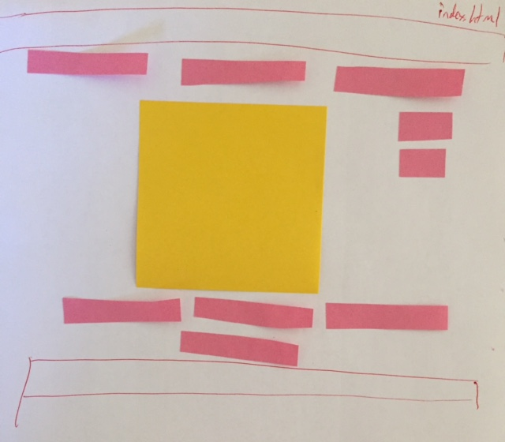
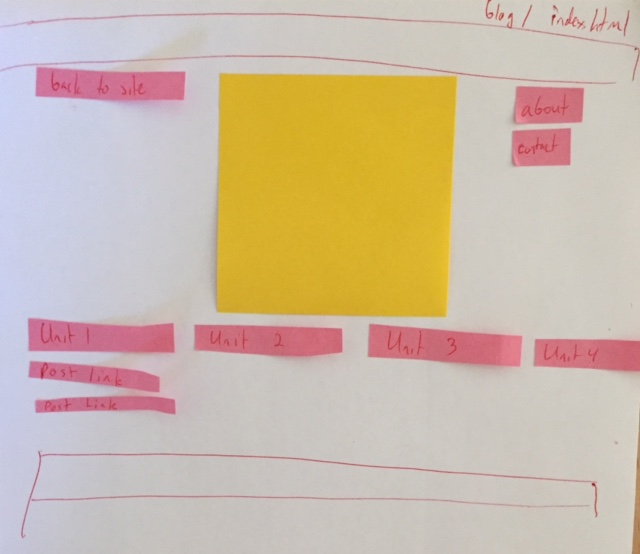

##What is a wireframe?
A wireframe is a mockup of just the visual parts of the site
##What are the benefits of wireframing?
It provides a framework for the designers to use when they're building the final site. It allows clients to get a rough idea of what the site will look like, and to give their input before all the effort is put into actually building the page.
##Did you enjoy wireframing your site?
I did! I had a pretty clear vision of what it was going to look like, but having the concrete images made me want to change things that I might not have thought of otherwise.
##Did you revise your wireframe or stick with your first idea?
I ended up revising it a little bit, but since I used post-its it was easy to do. I'm kind of a tactile learner, so I think I'll probably buy a magnet set if I find myself doing a lot of this. I liked using the physical elements better than mockingbird, which I used in GPS 2.7
##What questions did you ask during this challenge? What resources did you find to help you answer them?
"What makes a good mobile site?" That's a concern of mine because, working in marketing, I'm constantly monitoring how people are accessing the web, and increasingly it's by mobile. I want to make sure that the design of my site works well cross-platform. I actually visited a lot of sites on my phone for this.
##Which parts of the challenge did you enjoy and which parts did you find tedious?
I liked building the wireframe itself. I actually didn't have much of a problem with this challenge now that I'm more comfortable with git workflow than I was last week.